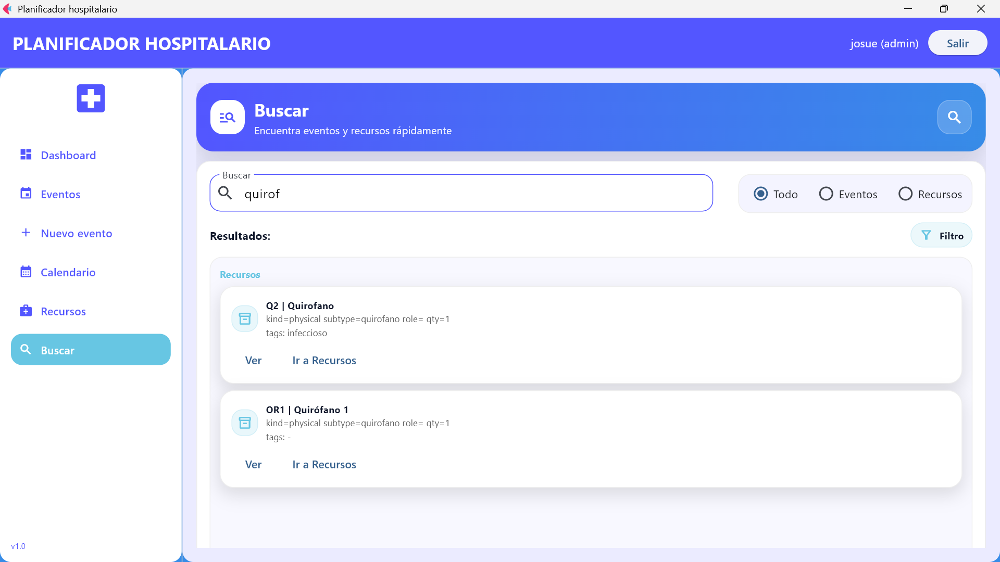

<div align="center">

# HospitalPlannerFlet

**Planificador inteligente de eventos para entornos hospitalarios**  
Construido con **Python + Flet** para escritorio (Windows).  
Gestión de **eventos**, **recursos** y validación de **conflictos** de disponibilidad en tiempo real.

<br/>


</div>

---

## Overview

**HospitalPlannerFlet** es una aplicación de escritorio diseñada para planificar eventos clínicos (cirugías, consultas, procedimientos, etc.) asignando recursos (físicos y humanos) de manera consistente.

El sistema ayuda a evitar errores comunes como:
- asignar el mismo recurso a múltiples eventos en el mismo rango horario,
- crear eventos con horarios inválidos,
- organizar la agenda diaria con slots clickeables y búsqueda rápida.

---

## Capturas

> Ubicación: `HospitalPlannerFlet/assets/`

<table>
  <tr>
    <td align="center"><b>Login</b></td>
    <td align="center"><b>Search</b></td>
  </tr>
  <tr>
    <td></td>
    <td></td>
  </tr>

  <tr>
    <td align="center"><b>Resources</b></td>
    <td align="center"><b>Events</b></td>
  </tr>
  <tr>
    <td></td>
    <td></td>
  </tr>

  <tr>
    <td align="center"><b>NewEvent</b></td>
    <td align="center"><b>Calendar</b></td>
  </tr>
  <tr>
    <td></td>
    <td></td>
  </tr>
</table>

---

## Funcionalidades principales

### Eventos
- Listado de eventos ordenados por fecha/hora.
- Edición y eliminación.
- Validación antes de guardar (conflictos detectados por el scheduler).

### Recursos
- Gestión de recursos físicos y humanos.
- Campos típicos: `kind`, `subtype`, `role`, `tags`, `quantity`.
- Catálogos integrados para selección rápida.

### Calendario diario
- Vista por día con slots clickeables.
- Selección rápida de rangos para crear eventos.

### Búsqueda
- Búsqueda global por tokens.
- Filtros: Todo / Eventos / Recursos.

### Autenticación local
- Login usando un archivo `users.json`.
- Roles disponibles vía `AuthManager` (`admin`, `staff`, etc.).

---

## Ejecución (Windows)

> La app se ejecuta desde la carpeta `HospitalPlannerFlet` usando el Python del `venv`.

```bat
REM 1) Entrar al directorio del proyecto
cd HospitalPlannerFlet

REM 2) Ejecutar la aplicación
venv\Scripts\python.exe app.py

REM (Opcional) Crear el entorno virtual
REM Solo si venv\ no existe en tu máquina
python -m venv venv

REM (Opcional) Instalar dependencias
REM Solo si existe requirements.txt dentro de HospitalPlannerFlet\
venv\Scripts\pip.exe install -r requirements.txt
Notas
La app es de escritorio (PC/Windows) y usa autenticación local mediante users.json.
El planificador valida conflictos (recursos no disponibles / choques de horario) antes de guardar cambios.
Licencia
Define la licencia que prefieras (MIT recomendada para empezar) y agrega un archivo LICENSE en la raíz del repositorio.