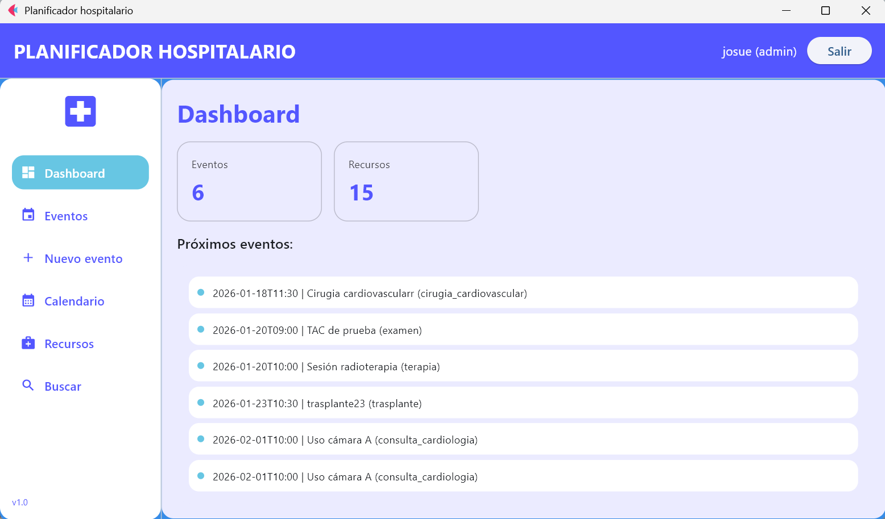
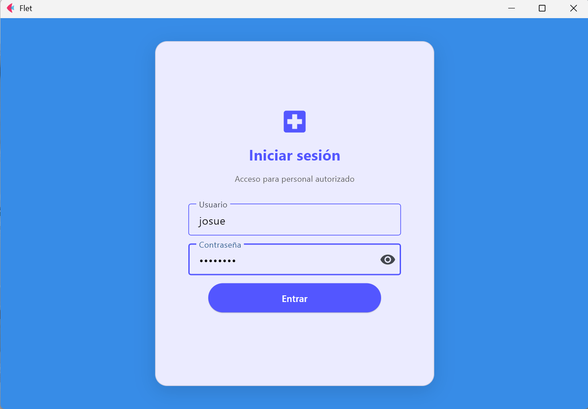
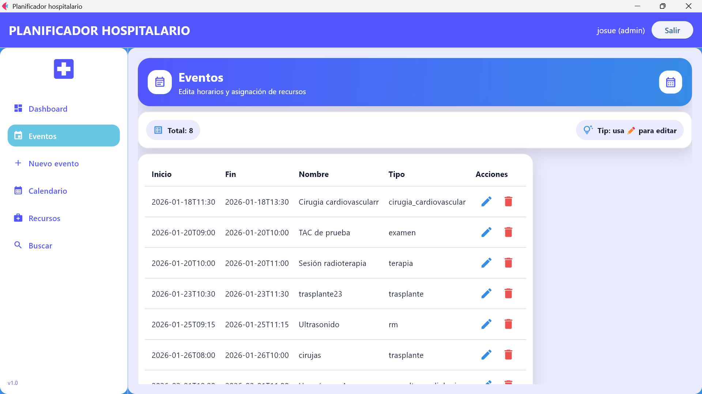
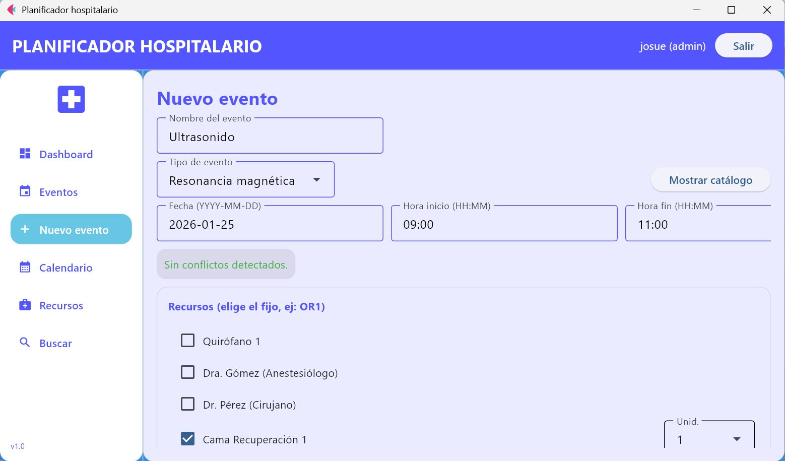
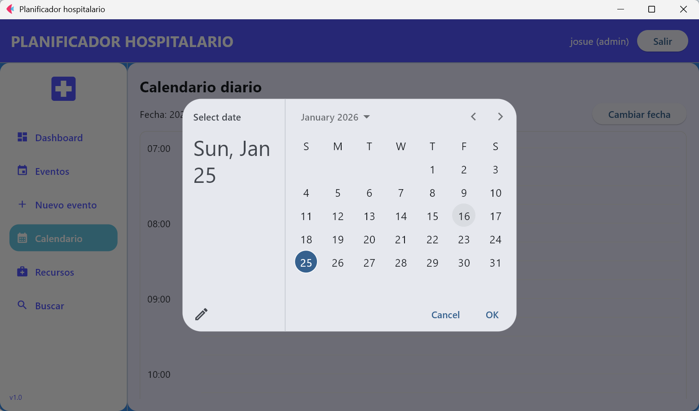
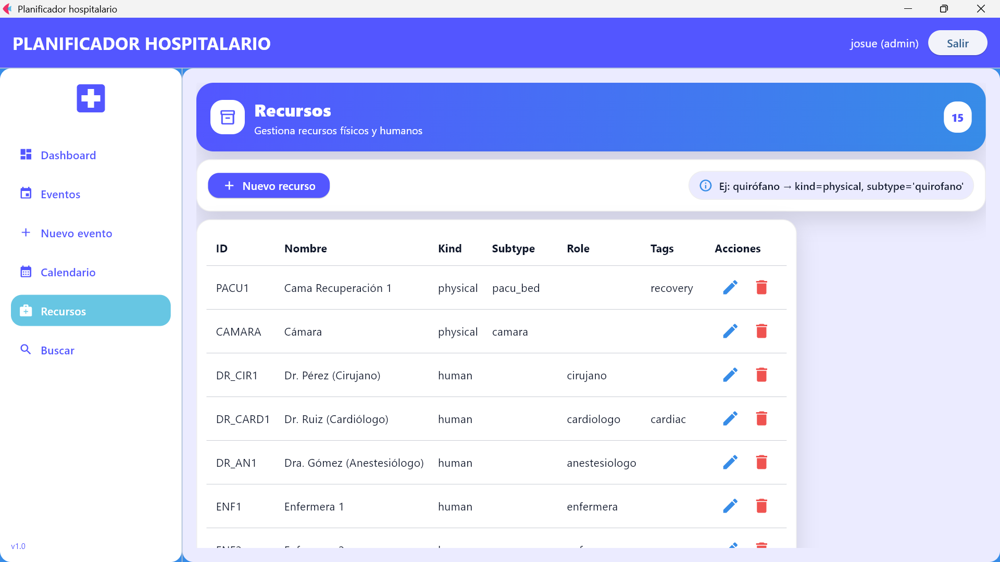
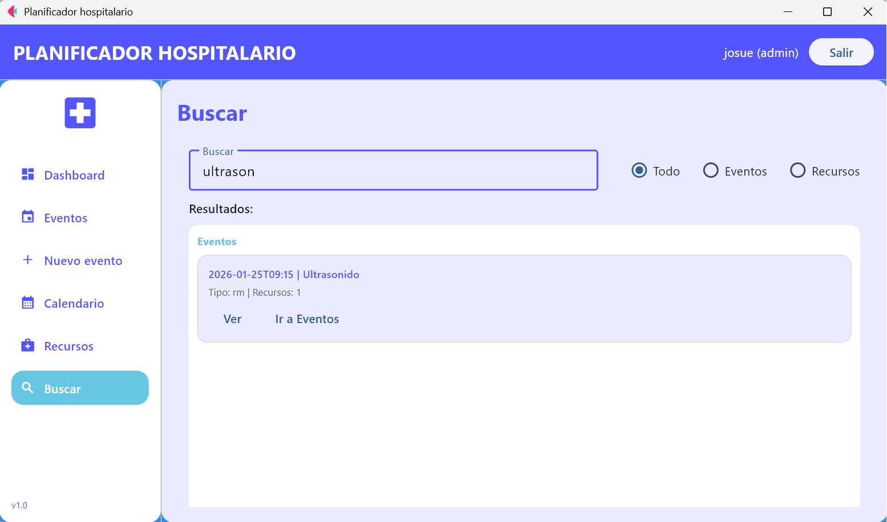

<div align="center">

# 🏥 HospitalPlannerFlet

<br/>



<br/>
<br/>

### Planificador Inteligente de Eventos Hospitalarios

*Sistema de gestión de eventos clínicos con validación de conflictos en tiempo real*

<br/>

[](https://python.org)
[](https://flet.dev)
[](https://www.microsoft.com/windows)
[](LICENSE)

<br/>

[🚀 Comenzar](#-instalación) · [📖 Documentación](#-funcionalidades) · [🖼️ Capturas](#-capturas-de-pantalla) · [🤝 Contribuir](#-contribución)

</div>

---

## 📋 Tabla de Contenidos

- [Sobre el Proyecto](#-sobre-el-proyecto)
- [Capturas de Pantalla](#-capturas-de-pantalla)
- [Características](#-características)
- [Requisitos](#-requisitos)
- [Instalación](#-instalación)
- [Uso](#-uso)
- [Estructura del Proyecto](#-estructura-del-proyecto)
- [Funcionalidades](#-funcionalidades)
- [Contribución](#-contribución)
- [Licencia](#-licencia)

---

## 🎯 Sobre el Proyecto

**HospitalPlannerFlet** es una aplicación de escritorio moderna diseñada para la planificación eficiente de eventos clínicos en entornos hospitalarios. Desarrollada con **Python** y el framework **Flet**, ofrece una interfaz intuitiva para gestionar cirugías, consultas, procedimientos y otros eventos médicos.

### ❌ Problemas que Resuelve

| Problema | Solución |
|----------|----------|
| Asignación duplicada de recursos | ✅ Validación automática de conflictos |
| Horarios superpuestos | ✅ Detección en tiempo real |
| Gestión desorganizada | ✅ Calendario visual con slots clickeables |
| Búsqueda lenta de eventos | ✅ Sistema de búsqueda global por tokens |

---

## 🖼️ Capturas de Pantalla

### 🔐 Login - Inicio de Sesión
*Pantalla de autenticación para acceder al sistema*

<div align="center">

</div>

<br/>

---

### 📋 Eventos - Gestión de Eventos
*Listado completo de eventos ordenados por fecha y hora*

<div align="center">

</div>

<br/>

---

### ➕ Nuevo Evento - Crear Eventos
*Formulario para crear nuevos eventos con validación de conflictos*

<div align="center">

</div>

<br/>

---

### 🗓️ Calendario - Agendar Citas
*Vista de calendario diario con slots clickeables para agendar citas*

<div align="center">

</div>

<br/>

---

### 🔧 Recursos - Gestión de Recursos
*Administración de recursos físicos y humanos del hospital*

<div align="center">

</div>

<br/>

---

### 🔍 Búsqueda - Filtrar Eventos y Recursos
*Sistema de búsqueda global con filtros por categoría*

<div align="center">

</div>

---

## ✨ Características

<table>
<tr>
<td width="50%">

### 📅 Gestión de Eventos
- Crear, editar y eliminar eventos
- Ordenamiento por fecha/hora
- Validación automática de conflictos
- Asignación de recursos

</td>
<td width="50%">

### 🔧 Control de Recursos
- Recursos físicos y humanos
- Catálogos integrados
- Campos personalizables
- Control de disponibilidad

</td>
</tr>
<tr>
<td width="50%">

### 🗓️ Calendario Interactivo
- Vista diaria detallada
- Slots clickeables
- Selección rápida de rangos
- Navegación intuitiva

</td>
<td width="50%">

### 🔍 Búsqueda Avanzada
- Búsqueda global por tokens
- Filtros: Todo / Eventos / Recursos
- Resultados instantáneos
- Interfaz limpia

</td>
</tr>
</table>

---

## 💻 Requisitos

| Requisito | Versión |
|-----------|---------|
|  | 3.8 o superior |
|  | Windows 10+ |
|  | Última versión |

---

## 🚀 Instalación

### Paso 1: Clonar el Repositorio

```bash
git clone https://github.com/tu-usuario/HospitalPlannerFlet.git
cd HospitalPlannerFlet
```

### Paso 2: Crear Entorno Virtual

```bash
# Crear el entorno virtual
python -m venv venv

# Activar el entorno virtual (Windows)
venv\Scripts\activate
```

### Paso 3: Instalar Dependencias

```bash
pip install -r requirements.txt
```

### Paso 4: Ejecutar la Aplicación

```bash
python app.py
```

---

## 📖 Uso

### Ejecución Rápida (Windows)

```batch
:: Navegar al directorio del proyecto
cd HospitalPlannerFlet

:: Ejecutar con el Python del entorno virtual
venv\Scripts\python.exe app.py
```

### Credenciales de Prueba

> ⚠️ **Nota:** El sistema usa autenticación local mediante `users.json`

| Rol | Descripción |
|-----|-------------|
| `admin` | Acceso completo al sistema |
| `staff` | Acceso a gestión de eventos |

---

## 📁 Estructura del Proyecto

```
HospitalPlannerFlet/
│
├── 📁 assets/                    # Imágenes y recursos estáticos
│   ├── bg.jpg                    # Imagen de fondo
│   ├── Dashboard.png             # Captura: Vista principal
│   ├── Login.png                 # Captura: Pantalla de login
│   ├── Events.png                # Captura: Gestión de eventos
│   ├── NewEvent.png              # Captura: Crear nuevo evento
│   ├── Calendar.png              # Captura: Calendario
│   ├── Resources.png             # Captura: Gestión de recursos
│   └── Search.png                # Captura: Búsqueda
│
├── 📁 models/                    # Capa de datos y lógica de negocio
│   ├── __init__.py
│   ├── constraint.py             # Restricciones y validaciones
│   ├── database_manager.py       # Gestión de base de datos JSON
│   ├── event.py                  # Modelo de eventos
│   ├── resource.py               # Modelo de recursos
│   └── scheduler.py              # Planificador y detección de conflictos
│
├── 📁 ui/                        # Interfaz de usuario (Flet)
│   ├── __init__.py
│   ├── design.py                 # Estilos y tema visual
│   ├── dialogs.py                # Diálogos y modales
│   ├── state.py                  # Estado global de la aplicación
│   ├── time_utils.py             # Utilidades de fecha/hora
│   │
│   ├── 📁 catalogs/              # Catálogos de tipos
│   │   ├── event_types.py        # Tipos de eventos disponibles
│   │   └── resource_types.py     # Tipos de recursos disponibles
│   │
│   └── 📁 views/                 # Vistas/Pantallas de la app
│       ├── calendar_day.py       # Vista de calendario diario
│       ├── dashboard.py          # Panel principal
│       ├── events.py             # Listado de eventos
│       ├── login.py              # Pantalla de autenticación
│       ├── new_event.py          # Formulario nuevo evento
│       ├── resources.py          # Gestión de recursos
│       └── search.py             # Búsqueda global
│
├── 📁 utils/                     # Utilidades generales
│   └── auth_manager.py           # Gestión de autenticación
│
├── 📁 venv/                      # Entorno virtual de Python
│
├── 📄 app.py                     # Punto de entrada principal
├── 📄 database.json              # Base de datos local (JSON)
├── 📄 users.json                 # Usuarios para autenticación
└── 📄 version.py                 # Información de versión
```

---

## 🔧 Funcionalidades

### 📋 Módulo de Eventos

| Función | Descripción |
|---------|-------------|
| **Crear** | Formulario completo con validación |
| **Editar** | Modificar eventos existentes |
| **Eliminar** | Eliminar con confirmación |
| **Validar** | Detección automática de conflictos |

### 🔧 Módulo de Recursos

```
Campos disponibles:
├── kind        → Tipo de recurso (físico/humano)
├── subtype     → Subtipo específico
├── role        → Rol asignado
├── tags        → Etiquetas para búsqueda
└── quantity    → Cantidad disponible
```

### 🗓️ Calendario Diario

- **Vista por día** con slots de tiempo clickeables
- **Selección rápida** de rangos horarios
- **Creación directa** de eventos desde el calendario
- **Navegación** entre días con facilidad

### 🔍 Sistema de Búsqueda

- **Búsqueda global** por múltiples tokens
- **Filtros disponibles:**
  - `Todo` - Buscar en todo el sistema
  - `Eventos` - Solo eventos
  - `Recursos` - Solo recursos

---

## ⚠️ Notas Importantes

> 💡 **Información clave sobre el sistema**

- 🖥️ Aplicación de **escritorio exclusiva para Windows**
- 🔐 Autenticación **local** mediante archivo `users.json`
- ✅ Validación de **conflictos en tiempo real** antes de guardar
- 📊 El scheduler detecta automáticamente:
  - Recursos no disponibles
  - Choques de horarios
  - Asignaciones duplicadas

---

## 🤝 Contribución

¡Las contribuciones son bienvenidas! Si deseas contribuir:

1. **Fork** el repositorio
2. Crea una **rama** para tu feature (`git checkout -b feature/NuevaCaracteristica`)
3. **Commit** tus cambios (`git commit -m 'Añadir nueva característica'`)
4. **Push** a la rama (`git push origin feature/NuevaCaracteristica`)
5. Abre un **Pull Request**

---

## 📄 Licencia

Este proyecto está bajo la Licencia **MIT**. Consulta el archivo [LICENSE](LICENSE) para más detalles.

---

<div align="center">

### ⭐ ¿Te gusta el proyecto? ¡Dale una estrella!

<br/>

**Desarrollado con ❤️ usando Python y Flet**

<br/>

[](https://python.org)
[](https://flet.dev)

</div>
